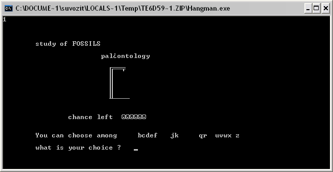
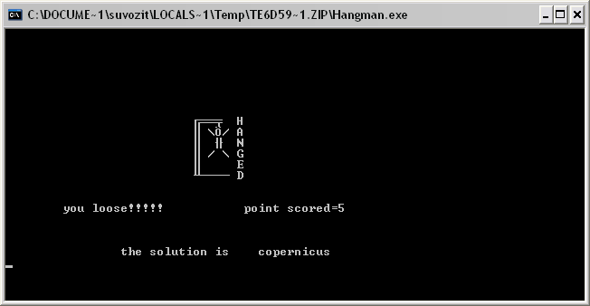
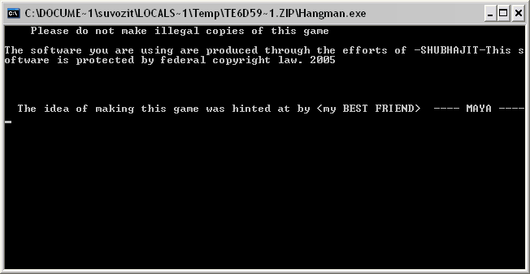

# FLOPPY-DISK-DRIVE-3.5

Retrieved Sample C++ source codes from 2005

# Hangman - my first game

This was my first game made in [Turbo C++][turbo] in 2005, when I was in class 11. Here are some screen shots.

After HANGED don't press any key to view the last screen shot but waiting 'll be very annoying.

Download the exe [Hangman.exe][exe] and the code [Hangman.cpp][cpp]. I know its ugly :)

[turbo]: http://en.wikipedia.org/wiki/Turbo_C%2B%2B
[exe]: Hangman.exe
[cpp]: Source%20Code/Hangman.cpp

[Blogger](https://bitsits.blogspot.com/2010/06/hangman-my-first-game.html)
[Tumblr](https://suvozit.tumblr.com/post/96197821158/hangman-my-first-game-this-was-my-first-game)
